# 🛡️ n8n Sentinel: Monitoring, Cleanup & Reporting

[](https://n8n.io/)
[](https://www.postgresql.org/)
[-25D366?style=flat&logo=whatsapp)](https://green-api.com/)

This workflow acts as the **System Administrator** for your n8n instance. It interacts directly with the internal PostgreSQL database to monitor execution errors, perform daily cleanup to prevent database bloat, and send weekly usage insights directly to WhatsApp.

---

## ⚡ Key Features

* **🚨 Error Watchdog (Daily):** Scans the execution logs for failed workflows in the last 24 hours. If failures are found, an alert is sent immediately with the workflow names and error counts.
* **🧹 Auto-Cleanup (Maintenance):** Automatically deletes old execution data (keeping only the last 1,000 records) to keep the database lightweight and fast.
* **📊 Weekly Insights:** Generates a report every Sunday showing which workflows ran the most during the week, helping you identify load and bottlenecks.
* **📱 Instant Notifications:** Uses GreenAPI to deliver reports and alerts directly to your WhatsApp.

---

## 🧩 Workflow Logic

```mermaid
graph TD
    %% --- 1. הגדרת סגנונות (Styles) ---
    classDef trigger fill:#E1BEE7,stroke:#4A148C,stroke-width:2px,color:#4A148C;
    classDef db fill:#BBDEFB,stroke:#0D47A1,stroke-width:1px,color:#0D47A1;
    classDef logic fill:#FFF9C4,stroke:#FBC02D,stroke-width:1px,stroke-dasharray: 5 5,color:#5D4037;
    classDef alert fill:#C8E6C9,stroke:#1B5E20,stroke-width:2px,color:#1B5E20;

    %% --- 2. הגדרת הצמתים (Nodes) ---
    %% Path 1 Nodes
    Cron1("🕐 Daily 00:05")
    SQL_Err[("🔍 SQL: Check Errors")]
    If_Err{"Errors > 0?"}
    Msg_Err("📝 Format Error Report")
    WA_Err["🚨 Send WhatsApp Alert"]
    End1((End))

    %% Path 2 Nodes
    Cron2("🕐 Daily 01:00")
    SQL_Clean[("🧹 SQL: Delete Old Executions")]
    End2((End))

    %% Path 3 Nodes
    Cron3("🕐 Weekly (Sun) 04:00")
    SQL_Stats[("📊 SQL: Count Weekly Runs")]
    Msg_Stats("📝 Format Weekly Report")
    WA_Stats["📈 Send WhatsApp Report"]

    %% --- 3. חיבורים (Connections) ---
    %% Error Check Flow
    Cron1 --> SQL_Err --> If_Err
    If_Err -- Yes --> Msg_Err --> WA_Err
    If_Err -- No --> End1

    %% Cleanup Flow
    Cron2 --> SQL_Clean --> End2

    %% Weekly Report Flow
    Cron3 --> SQL_Stats --> Msg_Stats --> WA_Stats

    %% --- 4. החלת עיצובים (Apply Styles) ---
    class Cron1,Cron2,Cron3 trigger
    class SQL_Err,SQL_Clean,SQL_Stats db
    class If_Err,Msg_Err,Msg_Stats logic
    class WA_Err,WA_Stats alert

```



## 🛠️ Setup & Configuration
Prerequisites
n8n with PostgreSQL: This workflow runs raw SQL queries. It is designed for self-hosted n8n instances using Postgres as the backend.

GreenAPI Account: For sending WhatsApp messages.

Installation
Import: Copy the JSON content and paste it into your n8n editor.

Credentials:

Update the Postgres node credentials to connect to your n8n internal DB.

Update the GreenAPI node credentials.

Parameters:

Change 123456789@g.us in the GreenAPI nodes to your actual WhatsApp Group/Chat ID.

## 🧠 Under the Hood (SQL Queries)
Here are the core queries used in this automation:

1. Failures Check
Identifies workflows that failed 'yesterday'.

```sql
SELECT w.name AS workflow_name, COUNT(*) AS error_count
FROM public.execution_entity e
JOIN public.workflow_entity w ON e."workflowId" = w.id
WHERE e.status = 'error'
  AND e."startedAt"::date = CURRENT_DATE - INTERVAL '1 day'
GROUP BY e."workflowId", w.name
ORDER BY error_count DESC
LIMIT 5;
```

2. Database Cleanup
Retains only the latest 1,000 executions to save disk space.
```sql
DELETE FROM public.execution_entity
WHERE id NOT IN (
  SELECT id FROM public.execution_entity
  ORDER BY id DESC
  LIMIT 1000
);
```

## ⚠️ Important Notes
Direct DB Access: This workflow modifies the database directly (DELETE operation). Ensure you have backups before running the cleanup node for the first time.

Timezones: The SQL queries rely on the database server's timezone. Ensure your Postgres server time matches your local time for accurate reporting.


