# 🚀 Enterprise N8N Automation & AI Orchestration
Welcome to my automation lab. This repository showcases advanced workflows designed to solve complex data challenges and streamline business operations.

## 🛠️ Infrastructure & Architecture
This environment is designed for high availability and security, mimicking production-grade enterprise setups. The entire stack is self-hosted and fully containerized.

Virtualization: Hosted on a dedicated Proxmox Virtual Environment (VE) to ensure resource isolation and snapshot capabilities.

Containerization: The core logic runs on Docker, orchestrated and managed via Portainer for streamlined lifecycle management.

Connectivity & Security: External webhooks and API endpoints are exposed securely via Cloudflare Tunnels (Zero Trust), eliminating the need for open ports and providing DDoS protection and SSL offloading.

```mermaid
graph LR
    User((☁️ Webhooks / APIs)) -->|Secure Tunnel| CF[Cloudflare Zero Trust]
    
    subgraph Private_Cloud [🏠 Private Cloud / Proxmox VE]
        CF -->|Proxied Traffic| VM[Linux VM]
        
        subgraph Docker_Stack [🐳 Docker Container Stack]
            direction TB
            Portainer[Portainer Agent] -.->|Manages| N8N[⚡ n8n Instance]
            N8N <-->|Reads/Writes| LocalDB[(Local DB / Files)]
        end
        
        VM --> Docker_Stack
    end

    style CF fill:#f38020,stroke:#333,color:#fff
    style N8N fill:#ff6d5a,stroke:#333,color:#fff
    style Docker_Stack fill:#e1f5fe,stroke:#01579b
```

## 💡 Key Focus Areas
### 🤖 AI Agents: Integrating LLMs (Gemini, OpenAI) into operational flows for semantic analysis and decision making.

### 🔄 Data Pipelines: Robust ETL processes, data synchronization, and transformation.

### 🔗 System Integration: Seamlessly connecting CRMs, SQL/NoSQL Databases, and communication tools (Slack/WhatsApp).

### ⚡ Advanced Logic: Utilizing custom JavaScript/Python nodes for complex data manipulation beyond standard nodes.

### 🛡️ Reliability: Built-in error handling, retry mechanisms, and execution logging.
